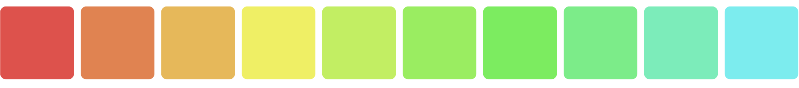

# Tailwind Color Plugin 🟥 🟧 🟨 🟩 🟦 




I ❤️ Tailwind and it has completely revolutionized the way we write CSS. But one thing I loathe is when I have to create new colors and color variations and leave code I am writing. It usually involves opening some color app, picking the color, adjusting the hue or shade in some minute way, editing the config to save the color, and repeating the process until it is correct. The goal is to be able to manipulate colors syntaxically in a same way we already use colors in Tailwind, but with slight modifications.

### Project Requirements

- Expressive, fluent, and chainable syntax that is easy to read and remember.
- Flexible and customizable to work for as many situations as possible.
- Must support all Tailwind colors and CSS colors, such as `hex`, `hsl`, and `rgb`.
- Make use of [color](https://www.npmjs.com/package/color) to manipulate the actual colors.
- Make use of [peggy](https://peggyjs.org/) to parse the expressions.
- Must work with Tailwind Intellisense for a quality developer experience.
- Full unit test coverage with Jest.
- Stability. No breaking changes whenever possible.

### A Little Background 

I built this plugin because I found myself running out colors, or not having enough subtlety between the color variations, especially when adding dark mode support to applications. The tonal difference between `slate` and `zinc` is the difference between `blue` and `brown` when it comes to consistently gradiated applications. In addition, the difference between `800` and `900` on any of on the standard colors is pretty large.

Let's take a button which has the attribute `class="rounded p-2 bg-blue-500 hover:bg-blue-600 active:bg-blue-700"`. Three different colors to represent each state, but difference between the active state and hover state are a bit too stark for my taste. What I really want is the ability to do something like `bg-blue-650` or `bg-blue-625` without having to define anything in the config, let alone take time to figure what those values would be for each instance. And I especially don't want to use a color picker application of any kind, but rather have consistent mathematical derivitives of the colors inline with those defined in the theme.

Let me introduce you to Tailwind Colorize...

## Installation

#### NPM
```bash
npm i tailwind-colorize-plugin
```

#### Yarn
```bash
yarn add tailwind-colorize-plugin
```

#### Tailwind Config
```js
// tailwind.config.js
const colorize = require('tailwind-colorize-plugin');

module.exports = {
    plugins: [
        colorize({
            // Document plugin options here
        })
    ]
}
```

## Getting Started

Your themes are one of the definition characters of your app. However, there are times you may just want to make slight adjustments, like wanting `slate.850` or `slate.825` without having to figure out what that value is. Or even, a blend of two color.

Tailwind Colorize doesn't take much to get start. It will parse your theme automatically. Not worry, anything that you have defined will stay the same unless it is a valid "colorized" syntax, in which is it be parsed and the returned color will be used. All the core Tailwind plugins are supported out of the box.

*Tip, if you want custom plugins to take advanvantage of Colorize, then be sure to include `colorize()` as the top of the `plugins: []` in the `tailwind.config.js` to it is installed first.*

```js
/** @type {import('tailwindcss').Config} */
module.exports = {
  content: [
    './index.html'
  ],
  theme: {
    extend: {
      colors: {
        'water': {
          'lighter': 'sky.500.lighten(.50)',
          'light': 'sky.500.lighten(.25)',
          DEFAULT: 'sky.500',
          'dark': 'sky.500.darken(.25)',
          'darker': 'sky.500.darken(.50)',
        }
      }
    },
  }
}
```

```html
<div class="bg-water-lighter w-24 h-24 rounded-lg"></div>
<div class="bg-water-light w-24 h-24 rounded-lg"></div>
<div class="bg-water w-24 h-24 rounded-lg"></div>
<div class="bg-water-dark w-24 h-24 rounded-lg"></div>
<div class="bg-water-darker w-24 h-24 rounded-lg"></div>
```


### Arbitrary Color Values

Due to a core plugin limitation in Tailwind CSS, you can't defined arbitrary colors values directly in your html. For example, Colorize allows you to do this using the `bgx` alternative to `bg`. You may use this same format with any property.

```html
<div class="bgx-[[red.500.mix(yellow.100,.1)]] w-24 h-24 rounded-lg"></div>
<div class="bgx-[red.500.mix(yellow.100,.2)] w-24 h-24 rounded-lg"></div>
<div class="bgx-[red.500.mix(yellow.100,.3)] w-24 h-24 rounded-lg"></div>
<div class="bgx-[red.500.mix(yellow.100,.4)] w-24 h-24 rounded-lg"></div>
<div class="bgx-[red.500.mix(yellow.100,.5)] w-24 h-24 rounded-lg"></div>
<div class="bgx-[red.500.mix(yellow.100,.6)] w-24 h-24 rounded-lg"></div>
<div class="bgx-[red.500.mix(yellow.100,.7)] w-24 h-24 rounded-lg"></div>
<div class="bgx-[red.500.mix(yellow.100,.8)] w-24 h-24 rounded-lg"></div>
<div class="bgx-[red.500.mix(yellow.100,.9)] w-24 h-24 rounded-lg"></div>
<div class="bgx-[red.500.mix(yellow.100,1)] w-24 h-24 rounded-lg"></div>
```

And you can use the same syntax if you want to define styles inside your CSS manually.

```css
.bg-water {
    @apply bgx-[sky.500.whiten(.1)]
}
```


## Available Methods

This plugin uses [color](https://www.npmjs.com/package/color) under the hood to process the actual color manipulations. The parser will analyze the syntax and expose a API that should feel very similar to the JS.

```js
color.negate()  // rgb(0, 100, 255) -> rgb(255, 155, 0)

color.lighten(0.5)  // hsl(100, 50%, 50%) -> hsl(100, 50%, 75%)
color.lighten(0.5)  // hsl(100, 50%, 0)   -> hsl(100, 50%, 0)
color.darken(0.5)   // hsl(100, 50%, 50%) -> hsl(100, 50%, 25%)
color.darken(0.5)   // hsl(100, 50%, 0)   -> hsl(100, 50%, 0)

color.lightness(50)  // hsl(100, 50%, 10%) -> hsl(100, 50%, 50%)

color.saturate(0.5)    // hsl(100, 50%, 50%) -> hsl(100, 75%, 50%)
color.desaturate(0.5)  // hsl(100, 50%, 50%) -> hsl(100, 25%, 50%)
color.grayscale()      // #5CBF54 -> #969696

color.whiten(0.5)   // hwb(100, 50%, 50%) -> hwb(100, 75%, 50%)
color.blacken(0.5)  // hwb(100, 50%, 50%) -> hwb(100, 50%, 75%)

color.fade(0.5)     // rgba(10, 10, 10, 0.8) -> rgba(10, 10, 10, 0.4)
color.opaquer(0.5)  // rgba(10, 10, 10, 0.8) -> rgba(10, 10, 10, 1.0)

color.rotate(180)  // hsl(60, 20%, 20%) -> hsl(240, 20%, 20%)
color.rotate(-90)  // hsl(60, 20%, 20%) -> hsl(330, 20%, 20%)

color.mix(Color("yellow"))        // cyan -> rgb(128, 255, 128)
color.mix(Color("yellow"), 0.3)   // cyan -> rgb(77, 255, 179)

// chaining
color.green(100).grayscale().lighten(0.6)
```

## Syntax

A PEG parser is used to analyze and tokenize the expression in real time. The expression must start with a color and may include methods chained together that will return a new `Color` instance. A color may be a CSS color name, a Tailwind theme color, `hex`, `rgb`, or `hsl` format. For a more detailed description of the grammar, you may wish to refer to the definition file `grammar.pegjs`.

*Due to the way CSS and Tailwind is parsed, the syntax is intentionally sensitive to whitespace. Opposite of Python, DO NOT use any spaces!*

### Color Syntax

Colors are defined by using their name as a literal, following by an optional weight, if its a theme color that has weights defined. The following are valid color example of how one would begin an expression.

```js
// Theme Colors
red.500
slate.900
yellow.200
white

// CSS Color Names
cornsilk
bisque
coral

// Color Functions
rgb(225,0,0)
hsl(0,84.2%,60.2%)

// Hex Codes
#eee
#e0e0e0
```

### Method Chaining

Methods arguments are recursive. Each method must return a new instance of `Color`, so each method in the chain modifies a new instance until it reaches the end of the line.

```js
// Theme Colors
red.500.darken(.1)
red.500.darken(.1).mix(yellow.200.darken(.1),.5)

// CSS Color Names
coral.darken(.1)
coral.darken(.1).mix(bisque.darken(.1),.5)

// Hex Codes
#eee.darken(.1)
#e0e0e0.darken(.1).mix(#eee,.5)
```